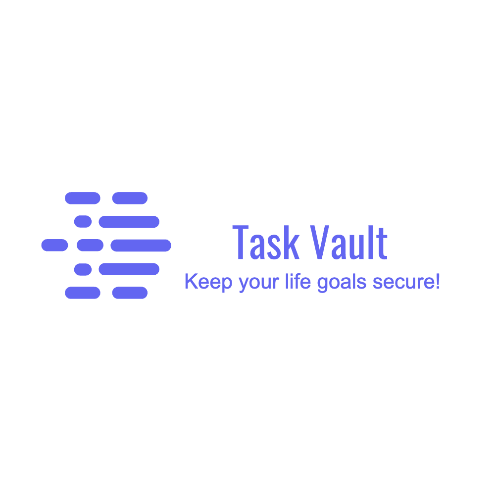
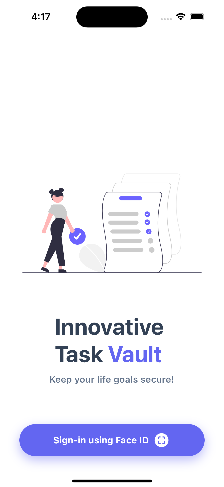
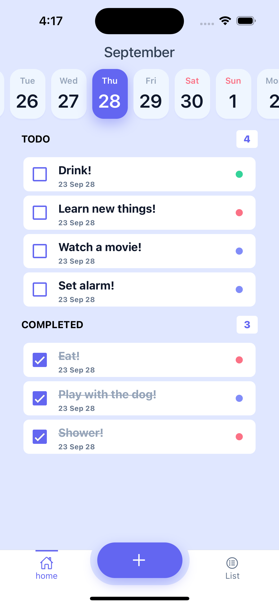
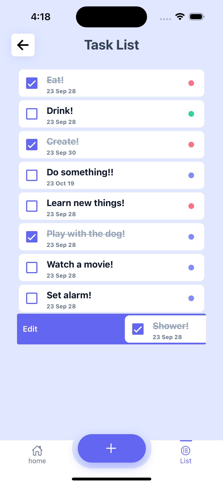
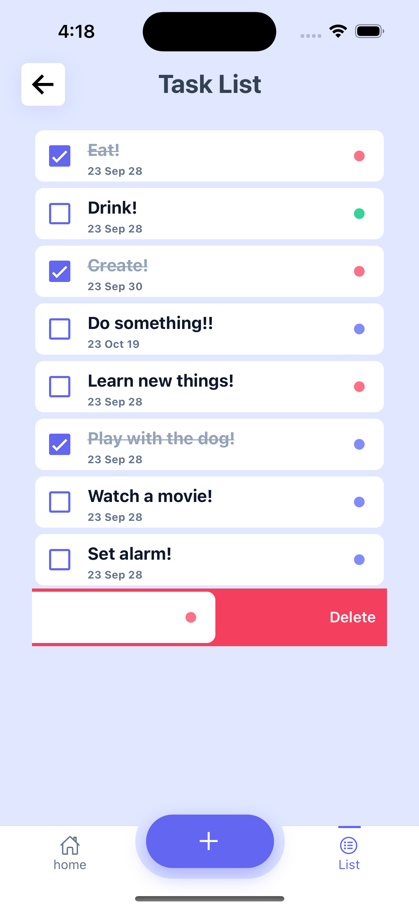

<!-- Improved compatibility of back to top link: See: https://github.com/othneildrew/Best-README-Template/pull/73 -->

<a name="readme-top"></a>

<!--
*** Thanks for checking out the Best-README-Template. If you have a suggestion
*** that would make this better, please fork the repo and create a pull request
*** or simply open an issue with the tag "enhancement".
*** Don't forget to give the project a star!
*** Thanks again! Now go create something AMAZING! :D
-->

<!-- PROJECT SHIELDS -->
<!--
*** I'm using markdown "reference style" links for readability.
*** Reference links are enclosed in brackets [ ] instead of parentheses ( ).
*** See the bottom of this document for the declaration of the reference variables
*** for contributors-url, forks-url, etc. This is an optional, concise syntax you may use.
*** https://www.markdownguide.org/basic-syntax/#reference-style-links
-->
<div align="left">
  [![Issues][issues-shield]][issues-url]
  [![LinkedIn][linkedin-shield]][linkedin-url]
  
</div>
<!-- PROJECT LOGO -->
<br />
<div align="center">
  <a href="https://github.com/manyuvll/task-vault">
    
  </a>

  <p align="center">
    Biometrically secured TODO list.
    <br />
Add/Edit/Delete tasks      
See tasks to do day by day 
    <br />
    <a href="https://github.com/manyuvll/task-vault/issues">Report Bug</a>
    <a href="https://github.com/manyuvll/task-vault/issues">Request Feature</a>

  </p>
</div>

<!-- TABLE OF CONTENTS -->
<details>
  <summary>Table of Contents</summary>
  <ol>
    <li>
      <a href="#about-the-project">About The Project</a>
      <ul>
        <li><a href="#built-with">Built With</a></li>
      </ul>
    </li>
    <li>
      <a href="#getting-started">Getting Started</a>
      <ul>
        <li><a href="#prerequisites">Prerequisites</a></li>
        <li><a href="#installation">Installation</a></li>
      </ul>
    </li>
    <li><a href="#usage">Usage</a></li>
    <li><a href="#license">License</a></li>
    <li><a href="#contact">Contact</a></li>
  </ol>
</details>

<!-- ABOUT THE PROJECT -->

## About The Project

Some features:

  <ul>
    <li>Create/Edit/Delete tasks</li>
    <li>Biometrics for login/add/edit/delete</li>
    <li>Day picker (will load around a month with the current day being in the middle)</li>
    <li>Swipe left/right to edit/delete</li>
    <li>Customized bottom Tabs</li>
  </ul>

<div>

<p align="center">
  
  
  
  
</p>

<p align="right">(<a href="#readme-top">back to top</a>)</p>

### Built With

- [![Expo][Expo]][Expo-url]
- 

<p align="right">(<a href="#readme-top">back to top</a>)</p>

<!-- GETTING STARTED -->

## Getting Started

### Prerequisites

If not already done, activate yarn by running this command:

- ```sh
  corepack enable
  ```

### Installation

1. Clone the repo
   ```sh
   git clone https://github.com/manyuvll/task-vault.git
   ```
2. Install YARN packages
   ```sh
   yarn
   ```
3. Run
   ```sh
   npx expo run:ios
   ```

<p align="right">(<a href="#readme-top">back to top</a>)</p>

<!-- USAGE EXAMPLES -->

## Usage

This app is optimized for iOS primarly.

<p align="right">(<a href="#readme-top">back to top</a>)</p>

<!-- LICENSE -->

## License

Distributed under the MIT License. See `LICENSE.txt` for more information.

<p align="right">(<a href="#readme-top">back to top</a>)</p>

<!-- CONTACT -->

## Contact

Project Link: [https://github.com/manyuvll/task-vault](https://github.com/manyuvll/task-vault)

<p align="right">(<a href="#readme-top">back to top</a>)</p>

<!-- MARKDOWN LINKS & IMAGES -->
<!-- https://www.markdownguide.org/basic-syntax/#reference-style-links -->

## Credits

app icon from <a href="https://www.freepik.com/free-photo/3d-illustration-pen-putting-blue-ticks-paper_33062183.htm#query=todo&position=3&from_view=search&track=sph">Image by upklyak</a> on Freepik

[issues-shield]: https://img.shields.io/github/issues/manyuvll/task-vault.svg?style=for-the-badge
[issues-url]: https://github.com/manyuvll/task-vault/issues
[license-shield]: https://img.shields.io/github/license/manyuvll/task-vault.svg?style=for-the-badge
[license-url]: https://github.com/manyuvll/task-vault/blob/master/LICENSE.txt
[linkedin-shield]: https://img.shields.io/badge/-LinkedIn-black.svg?style=for-the-badge&logo=linkedin&colorB=555
[linkedin-url]: https://www.linkedin.com/in/emanuele-vella/
[login]: docs/images/login.png
[home]: docs/images/home.png
[swipeleft]: docs/images/swipeleft.png
[swiperight]: docs/images/swiperight.png
[add-edit]: docs/images/add-edit.png
[Expo]: https://img.shields.io/badge/Expo-fff.svg?style=for-the-badge&logo=EXPO&labelColor=fff&logoColor=000
[Expo-url]: https://expo.dev/
